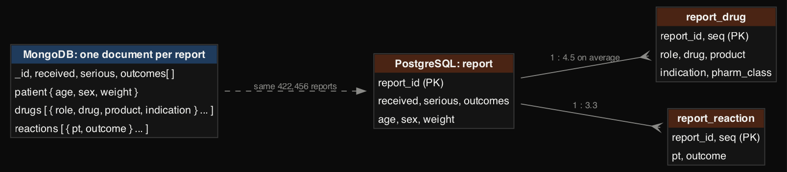
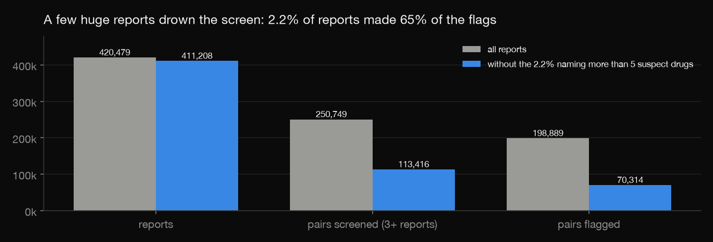
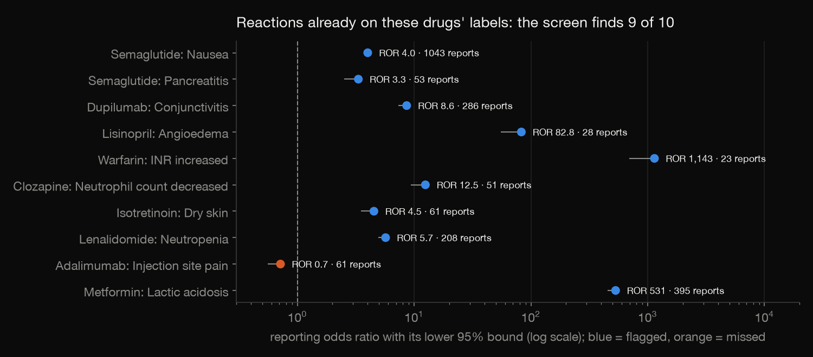
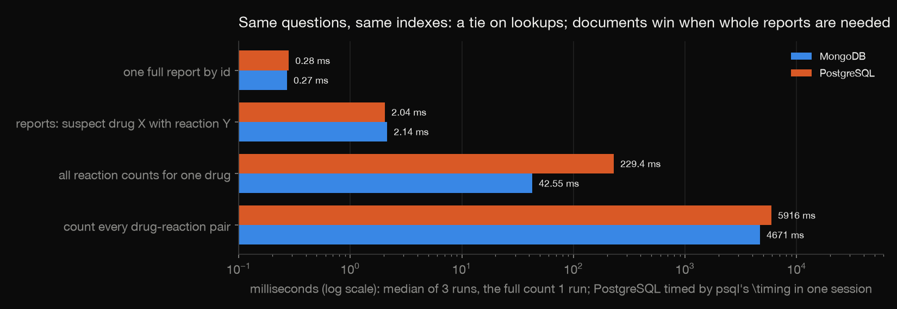

# Drug safety signals in MongoDB and PostgreSQL

The FDA's adverse event reports (FAERS) arrive as deeply nested JSON: each report has a patient, a list of drugs and a
list of reactions. This project loads one quarter, 422,456 reports from April–June 2026, two ways:
- **MongoDB:** one document per report;
- **PostgreSQL:** three normalised tables.

Then it runs the standard first pass in drug-safety work, a disproportionality screen, in both. It checks that the two
agree, and compares what each one is good at.

Build log: https://mrrishit909.github.io/projects/drug-events-mongo-postgres/

## Data

openFDA drug event download (`api.fda.gov/download.json`), 2026 Q2: 36 zipped JSON files, 3.4 GB, export of
28 September 2026. `download.py` fetches them. They are not committed.

Each report is slimmed once (`parse.py`):
- **Kept:** dates, seriousness, reporter, age, sex, weight, every drug (role, names, indication) and every reaction (MedDRA term).
- **Dropped:** the free-text case narrative.

A drug is named by FDA's harmonised generic name when openFDA matched it (81.6% of drug rows), else the reported active
substance, else the product name.

## Steps

| Step | File | What it does |
|---|---|---|
| 1 | `download.py` | the 36 files |
| 2 | `parse.py` | one slim document per report (`data/reports.ndjson`), and the same reports as three CSV tables |
| 3 | `run.sh`, `sql/01_schema.sql`, `sql/02_indexes.sql`, `load.py` | the project's own PostgreSQL (port 5435) and MongoDB (27018); load and index both |
| 4-5 | `sql/03_signals.sql`, `analyze.py` | PRR, ROR and chi-square in SQL; the same pair counts as a MongoDB aggregation; four questions timed in both |
| 6 | `check.py` | a third implementation, in plain Python from the documents |
| 7 | `charts.py` | charts |

Run: `python3 -m venv venv && ./venv/bin/pip install certifi ijson pymongo pandas matplotlib`, then
`./venv/bin/python download.py && ./venv/bin/python parse.py && ./run.sh start && ./venv/bin/python load.py && ./venv/bin/python analyze.py && ./venv/bin/python check.py`.
PostgreSQL 18 and MongoDB 8.3 come from a micromamba environment (`~/micromamba/envs/analyst`).

## Two models of the same report

| | MongoDB | PostgreSQL |
|---|---|---|
| rows | 422,456 documents | 422,456 + 1,918,159 drug + 1,394,727 reaction rows |
| on disk | 84 MB data + 24 MB indexes | 356 MB tables + 282 MB indexes |
| load + index | 6.4 s + 3.9 s | 29.3 s + 5.0 s |

The schema's CHECK on drug role caught **role 4**, "drug not administered" in the newer E2B(R3) standard. It occurs in
548 rows, and the openFDA field reference does not list it.

## Signal screen

For each suspect drug and reaction, the screen compares how often the reaction is reported with this drug against
all other drugs:
- PRR and ROR (with a 95% interval) and Yates chi-square;
- a pair is flagged when it has at least 3 reports, PRR ≥ 2 and chi-square ≥ 4 (Evans 2001).

**A few huge reports drown the screen.** 9,271 reports (2.2%) name more than 5 suspect drugs, and one names 2,738
suspect rows. Each such report pairs every drug with every reaction. Without them the flags fall from 198,889 to 70,314,
so those 2.2% of reports made 65% of the flags. The main screen leaves them out; `results/screen_sensitivity.csv` has both.

**It finds what is on the labels.** Of 10 reactions already in these drugs' US labels, 9 are flagged, for example:
- semaglutide and nausea: 1,043 reports, ROR 4.0;
- lisinopril and angioedema: ROR 82.8;
- metformin and lactic acidosis: ROR 531.

The miss is adalimumab and injection-site pain (ROR 0.72). So many injectable biologics report injection-site
reactions that the comparison group drowns it.

**Flags are not findings.** The top flags include the conditions the drugs treat (adalimumab with Crohn's disease) and
device problems (semaglutide with device leakage). A screen points at what to review; it does not say a drug caused
anything.

## Which database for which job

| Question | MongoDB | PostgreSQL |
|---|---|---|
| one full report by id | 0.27 ms | 0.28 ms |
| reports with suspect drug X and reaction Y | 2.14 ms | 2.04 ms |
| all reaction counts for one drug | 42.55 ms | 229.4 ms |
| count every drug-reaction pair | 4.7 s | 5.9 s |

MongoDB is timed with pymongo, and PostgreSQL with psql's `\timing` inside one session, so process start-up isn't in
the numbers. Both have the same indexes (drug, reaction).

Lookups tie. Questions that need whole reports favour documents, because there is no join. SQL is still the better
place for the statistics themselves: the contingency table, PRR and chi-square are a few lines of SQL, and constraints
caught a bad assumption on load.

## The check

`check.py` recomputes, in plain Python from `data/reports.ndjson`:
- the counts (documents = MongoDB = PostgreSQL; drug and reaction rows);
- every one of the 113,416 screened pairs: a, b, c, d, PRR, ROR and chi-square.

It also confirms that MongoDB's aggregation agreed with PostgreSQL on every pair.

## Not done

- One quarter only. FAERS also has duplicate cases across sources that openFDA does not merge; there is no case-level de-duplication here.
- Drug names are matched as written after normalisation. No mapping of brand names to ingredients beyond openFDA's own.
- MedDRA terms are not grouped (for example "nausea" and "vomiting" stay separate).
- Disproportionality is a screen, not evidence of causation, and reporting is voluntary and biased.
